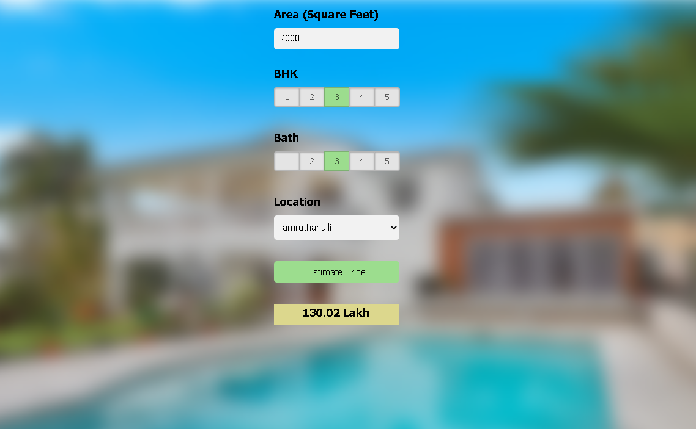

# Real Estate Price Detection

### Small machine learning project

builded a model using sklearn and linear regression using banglore home prices dataset from kaggle.com. Second step would be to write a python flask server that uses the saved model to serve http requests. Third component is the website built in html, css and javascript that allows user to enter home square ft area, bedrooms etc and it will call python flask server to retrieve the predicted price. During model building we will cover almost all data science concepts such as data load and cleaning, outlier detection and removal, feature engineering, dimensionality reduction, gridsearchcv for hyperparameter tunning, k fold cross validation etc. 
## Technology and tools wise this project covers.
1. Python
2. Numpy and Pandas for data cleaning
3. Matplotlib for data visualization
4. Sklearn for model building
5. Jupyter notebook, visual studio code and pycharm as IDE
6. Python flask for http server
7. HTML/CSS/Javascript for UI




<a id="contribute"></a>
## Step to Contribute

<details><summary>Click here</summary>
<p>

**1.**  Fork [this](https://github.com/Google-Developer-Student-Club-RAIT/Real_estate_price_detection-AI-ML) repository.

**2.**  Clone your forked copy of the project.

```
git clone https://github.com/Google-Developer-Student-Club-RAIT/Real_estate_price_detection-AI-ML.git 
```

**3.** Navigate to the project directory :file_folder: .

```
cd Real_estate_price_detection-AI-ML
```

**4.** Add a reference(remote) to the original repository.

```
git remote add upstream https://github.com/Google-Developer-Student-Club-RAIT/Real_estate_price_detection-AI-ML
```

**5.** Check the remotes for this repository.
```
git remote -v
```

**6.** Always take a pull from the upstream repository to your master branch to keep it at par with the main project(updated repository).

```
git pull upstream main
```

**7.** Create a new branch.

```
git checkout -b <your_branch_name>
```

**8.** Perform your desired changes to the code base.


**9.** Track your changes:heavy_check_mark: .

```
git add . 
```

**10.** Commit your changes .

```
git commit -m "Relevant message"
```

**11.** Push the committed changes in your feature branch to your remote repo.
```
git push -u origin <your_branch_name>
```

**12.** To create a pull request, click on `compare and pull requests`. Please ensure you compare your feature branch to the desired branch of the repository you are supposed to make a PR to.


**13.** Add appropriate title and description to your pull request explaining your changes and efforts done.


**14.** Click on `Create Pull Request`.


**15** Congratulations! You have made a PR. Sit back patiently and relax while your PR is reviewed.


</p>
</details>

## Code-Style

// make wiki guide page for kotlin code-style  

### Contributors

### Contact

Maintainer : jadhavAkshay0701@gmail.com

## LICENSE
Copyright (c) **GDSC Rait**. All rights reserved. Licensed under the MIT License

[](LICENSE)
